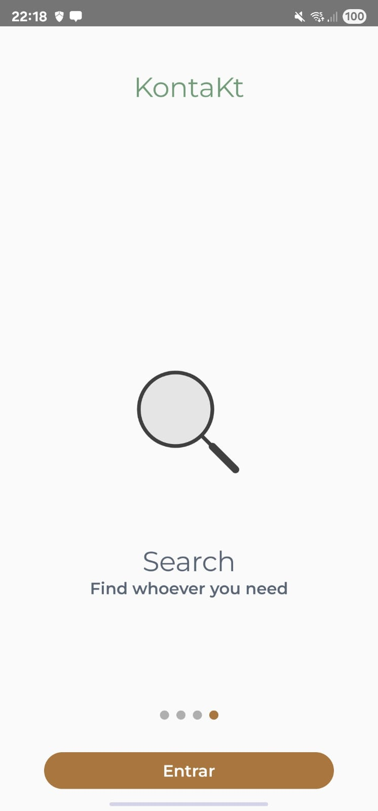
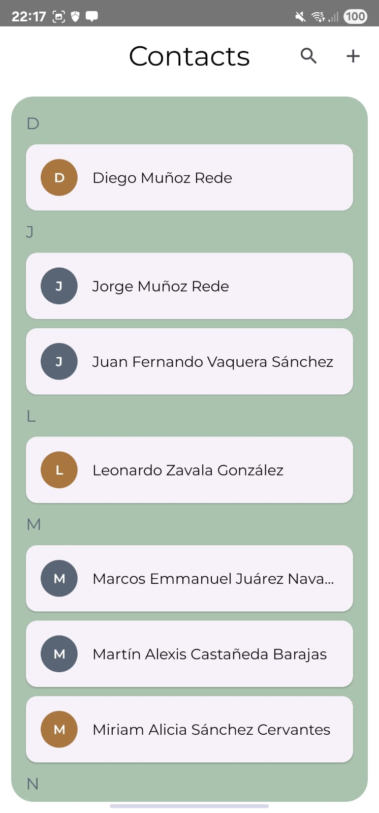
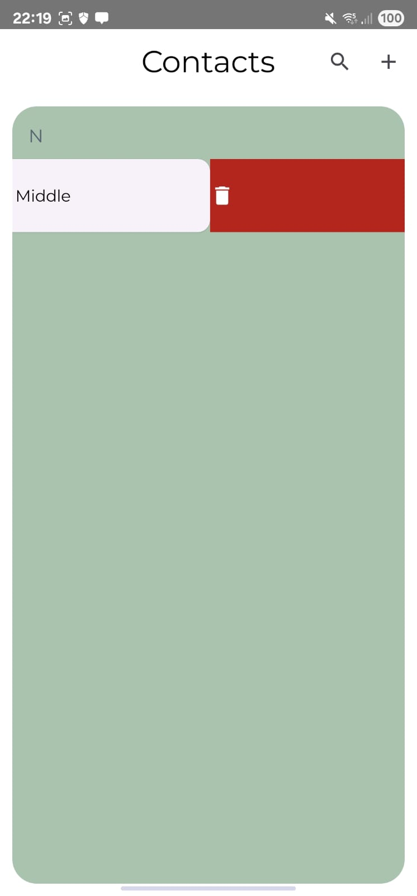
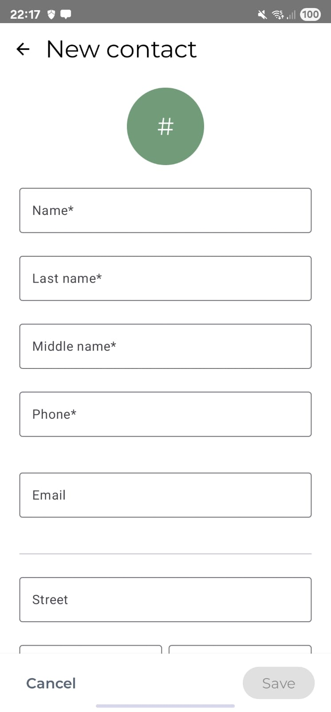
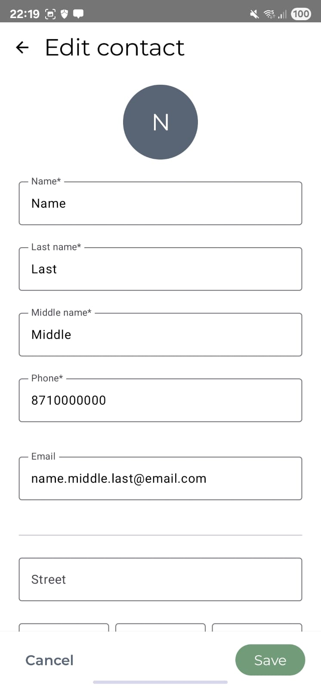
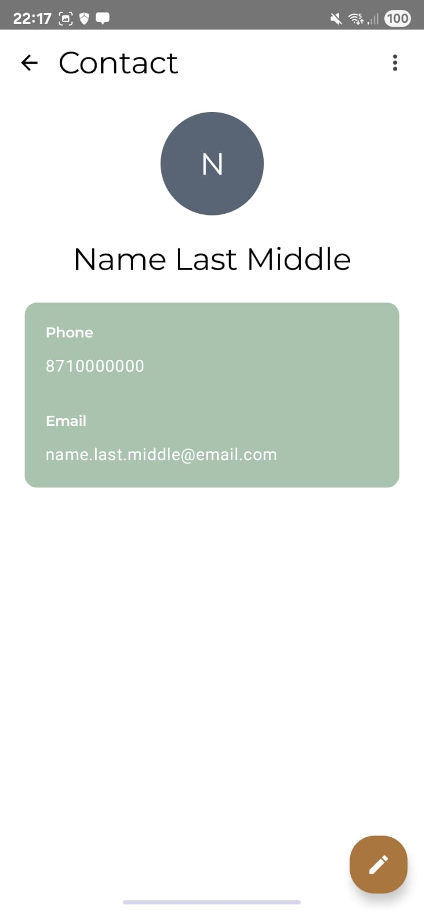

<div align="center">


# 📱 KontaKt

**A beautifully crafted offline-first contacts app for Android**

*Built with 100% Jetpack Compose • Material Design 3 • Offline-First Architecture*

[](https://kotlinlang.org/)
[](https://developer.android.com/jetpack/compose)
[](https://m3.material.io/)
[](https://developer.android.com/training/data-storage/room)

</div>

---

## 🌟 **Overview**

KontaKt redefines contact management with a **privacy-first**, **offline-only** approach. Every feature has been meticulously designed and coded from scratch – from the custom color palette and typography system to comprehensive form validation and smooth animations.

> 🔒 **Privacy-First**: No internet permissions • No data collection • Complete offline functionality

---

## ✨ **Features That Matter**

### 🚀 **Seamless User Experience**
- **Animated Onboarding** – Welcome users with stunning Lottie animations and smooth page transitions
- **Intuitive Navigation** – Gesture-based interactions with swipe actions and contextual menus
- **Smart Search** – Real-time contact filtering with instant results
- **Adaptive Design** – Perfect experience across all screen sizes

### 📊 **Advanced Contact Management**
- **Complete CRUD Operations** – Create, read, update, and delete contacts effortlessly
- **Smart Validation** – Real-time form validation with helpful error messages
- **Grouped Display** – Contacts organized alphabetically for quick access
- **Dynamic Avatars** – Beautiful color-coded avatars generated from contact names

### 🎨 **Beautiful Design System**
- **Custom Material 3 Theme** – Handcrafted color palette with Cambridge Blue, Copper, and Payne Gray
- **Dark Mode Support** – Seamless light/dark theme switching
- **Dynamic Colors** – Adaptive color system that respects user preferences
- **Consistent Typography** – Premium Montserrat font family throughout

---

## 🖼️ **Screenshots**

<div align="center">

| 🎯 **Onboarding** | 🏠 **Home** | 🗑️ **Swipe Actions** |
|:---:|:---:|:---:|
|  |  |  |

| ➕ **Add Contact** | ✏️ **Edit Contact** | 👤 **Contact Details** |
|:---:|:---:|:---:|
|  |  |  |

</div>

---

## 🏗️ **Architecture**

KontaKt follows **Clean Architecture** principles with a clear separation of concerns:

```
🏢 com.kontakt.app/
├── 🧭 core.navigation/          # Navigation routes & NavHost configuration
├── 💾 data/
│   ├── local/
│   │   ├── database/            # Room entities, DAOs & database setup
│   │   └── datastore/           # Preferences & app state management
│   └── repository/              # Data access abstraction layer
├── 🎯 features/
│   ├── contactos/
│   │   ├── viewmodel/           # Business logic & state management
│   │   └── views/               # UI components & screens
│   └── onboarding.views/        # Welcome flow components
└── 🎨 ui.theme/                 # Design system & theming
```

---

## 🎨 **Design System**

### **Color Palette**
<div align="center">

| Color | Hex | Usage |
|-------|-----|-------|
| **Cambridge Blue** | `#729B79` | Primary actions & highlights |
| **Copper** | `#A8763E` | Secondary elements & accents |
| **Payne Gray** | `#596475` | Tertiary content & subtle details |

</div>

### **Typography & Spacing**
- **Font Family**: Montserrat (Regular, SemiBold, Bold)
- **Spacing Scale**: 4dp, 8dp, 16dp, 24dp, 32dp
- **Corner Radius**: 6dp, 12dp, 24dp for different component sizes

---

## 🛠️ **Tech Stack**

### **Core Technologies**
-  **Modern Kotlin** with coroutines
-  **100% Jetpack Compose** UI
-  **Material Design 3** components

### **Data & Storage**
-  **Room Database** for local storage
-  **DataStore** for app preferences

### **Libraries & Tools**
- **Navigation Compose** – Type-safe navigation
- **Hilt/Dagger** – Dependency injection (ready to use)
- **Lottie Compose 6.3** – Smooth animations
- **Accompanist Pager** – Onboarding carousel
- **Swipe Actions** – Interactive gestures

---

## 🔐 **Validation System**

Smart form validation ensures data integrity:

```kotlin
// 📞 Phone validation - Supports international & local formats
val phoneRegex = """^\+(\d{1,3})?\s?\d{2,3}(?:\s?\d{3}){2}$|^\d{10}$""".toRegex()

// 📧 Email validation - Comprehensive pattern matching
val emailRegex = """^[A-Za-z0-9._%+-]+@[A-Za-z0-9.-]+\.[A-Za-z]{2,}$""".toRegex()
```

**Real-time validation** prevents invalid data entry and provides immediate feedback.

---

## 🚀 **Quick Start**

### **Prerequisites**
- Android Studio Giraffe or newer
- Android SDK API 24+
- Kotlin 1.9+

### **Setup Instructions**

1. **Clone the repository**
   ```bash
   git clone https://github.com/dgmnzrd/KontaKt-DAA.git
   cd KontaKt-DAA
   ```

2. **Add Montserrat fonts**
   
   Download and place these files in `app/src/main/res/font/`:
   - `montserrat_regular.ttf`
   - `montserrat_semibold.ttf`
   - `montserrat_bold.ttf`

3. **Build and run**
   ```bash
   ./gradlew assembleDebug
   # Or simply click "Run" in Android Studio
   ```

> 🎉 **That's it!** No API keys, no configuration files, no internet required.

---

## 🔮 **Roadmap**

### **Upcoming Features**
- [ ] 📷 **Custom Avatar Images** – Photo picker integration
- [ ] 📤 **Data Export/Import** – JSON backup system
- [ ] 📧 **vCard Sharing** – Standard contact format support
- [ ] 🔍 **Advanced Search** – Filter by categories and fields
- [ ] 🏷️ **Contact Categories** – Organize with custom tags

### **Technical Improvements**
- [ ] 🧪 **Unit Tests** – Comprehensive test coverage
- [ ] 🎯 **Performance Optimization** – Large dataset handling
- [ ] 🌐 **Localization** – Multi-language support

---

## 🤝 **Contributing**

We welcome contributions! Please read our [Contributing Guidelines](CONTRIBUTING.md) before submitting PRs.

### **Development Guidelines**
- Follow [Android's official coding standards](https://developer.android.com/kotlin/style-guide)
- Maintain consistent code formatting
- Add tests for new features
- Update documentation accordingly

---

## 📜 **License**

```
MIT License

Copyright (c) 2025 KontaKt

Permission is hereby granted, free of charge, to any person obtaining a copy
of this software and associated documentation files (the "Software"), to deal
in the Software without restriction, including without limitation the rights
to use, copy, modify, merge, publish, distribute, sublicense, and/or sell
copies of the Software, and to permit persons to whom the Software is
furnished to do so, subject to the following conditions:

The above copyright notice and this permission notice shall be included in all
copies or substantial portions of the Software.
```

---

<div align="center">

**Built with ❤️ and Jetpack Compose**

*Privacy-first • Offline-only • Beautiful by design*

[](https://github.com/yourusername/kontakt)

</div>